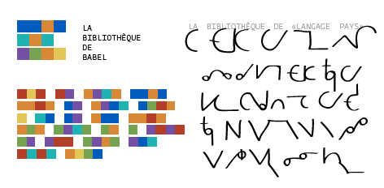

# solresol-api

**Solresol** was a constructed language invented in 1827 by Jean Francois Sudre

It can represent words by a set of colors, notes, drawings, or letters. 

### example: “The Library of Babel”

## how to use

| Route | |
|-|-|
| `/en/srs/{word}` | translates from English to SolReSol|
| `/srs/en/{word}` | translate SolReSol letters to English |

## architecture

<!-- todo -->

## references

* see [data folder](data/)
* https://en.wikipedia.org/wiki/Solresol

