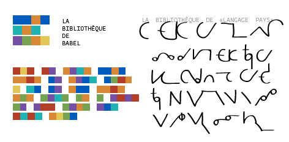

# solresol-api

**Solresol** was a constructed language invented in 1827 by Jean Francois Sudre

It can represent words by a set of colors, notes, drawings, or letters. 


### example: “The Library of Babel”



## how to use

| Route | |
|-|-|
| `/en/srs/{word}` | translates from English to SolReSol|
| `/srs/en/{word}` | translate SolReSol letters to English |

## run locally
```
cd app && npm install && npm start
# or -- not used anymore
# docker build . -t <your username>/node-web-app
# docker run -p 49160:8080 -d <your username>/node-web-app
```

## architecture

<!-- todo -->

## references

* see the [`_data/` folder](data/)
* https://en.wikipedia.org/wiki/Solresol

